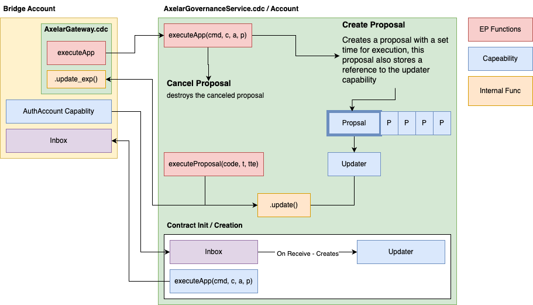

# Governance & Updateability

Governance updates on FLOW are required to be executed significantly differently from EVM implementations.  This is due to Flows native "updateability" and utilization of proxy contracts in EVM.

## Key Differences
- Flow's native abstracted account model allows for natively updatable contracts which are executed through a simple call to the hosting `AuthAccount`'s API compared to EVMs typical deploy and replace proxy upgrades
    - Because of this we must use the cadence .update_expirimental() function to allow a Governance contract to update the parent contract.
- Proxy contracts can easily be updated by any EVM address as long as the correct access control measures have been met.  In Flow we must give a AuthAccount Capability in order to enable the Governance contract to update the parent contract.
    - This makes it so future governance contract swaps are slightly more complicated as access to the parent contract's account is still needed to hand over the capability.

## Proposed Solution
We will assume the bridge account is deployed and waiting for a governance contract
### Setup
1. The governance contract is deployed
2. The "bridge account" or account to be updated will give an AuthAccount capability to the governance contract
3. On receival of the capability in the governance accounts inbox, the governance contract will create a Updater capability and store it in a dictionary mapped to its address
    - The Updater capability will store the AuthAccount capability and have a `update()` function that will updated the accounts contract using the `update__expirimental()` function
4.  The governance contract will then give a `executeApp()` capability to the bridge account so the governance can be called like a Axelar Executable
### Updates
5. The AxelarGateway Contract receives a valid GMP which calls the `executeApp` of the governance contract to initiate the proposal creation
6. The Proposal is created in the governance contract and stored in a `proposal` capability in a key/value pair dictionary which its key is some unique repllicateable hash
    - The proposal stores a reference to the Updater capability which will be in reference to the contract to being updated.
    - A certain time of execution is also stored with a minimum time before execution.  This is to allow the contract managers to throughly approve any updates.
7. Some time passes
8. Anyone can call the `executeProposal` function on the governance contract with the correct code, target contract, and time to execution.
    - This checks if the proposal is ready to be executed, if not it fails out.
    - if a proposal with all of this data does not exist then the function errors.
9. Proposal executes and `update__expirimental()` is called on the desired contract

## Concerns / Questions
- How do we deal with simulating updates of the contracts code to ensure it can be safely updated?
    - is this simulation done at the Axelar network level?
    - I see some function 'tryUpdate' [here](https://github.com/sisyphusSmiling/contract-updater/blob/4fab9c84bf8101c9c18c9a0fb78e796ee16ef7aa/contracts/ContractUpdater.cdc#L161).  Is this a built in cadence function?
